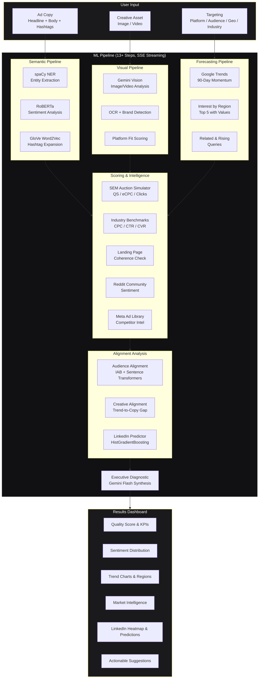
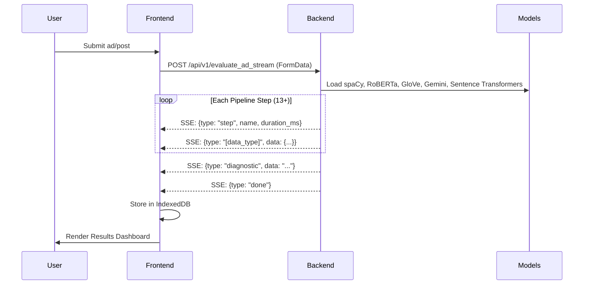
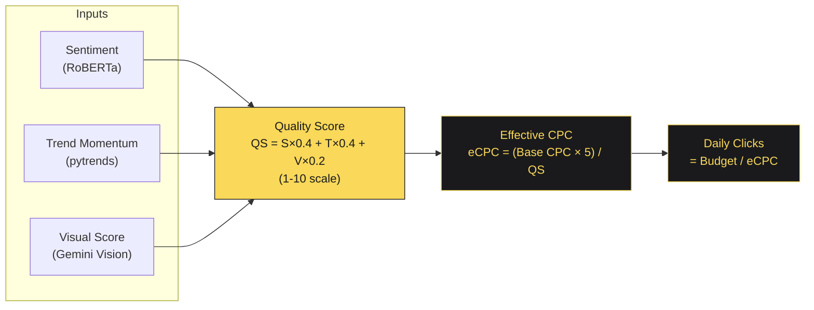
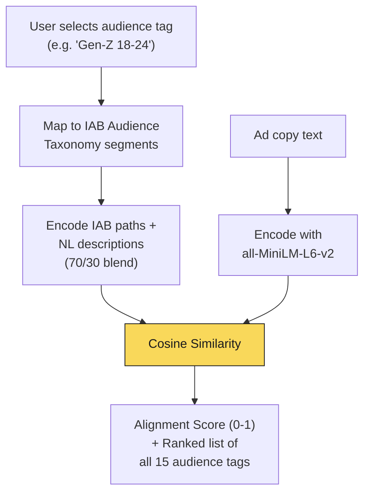
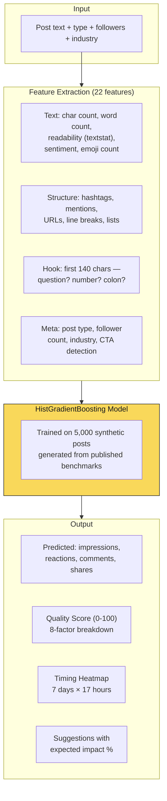
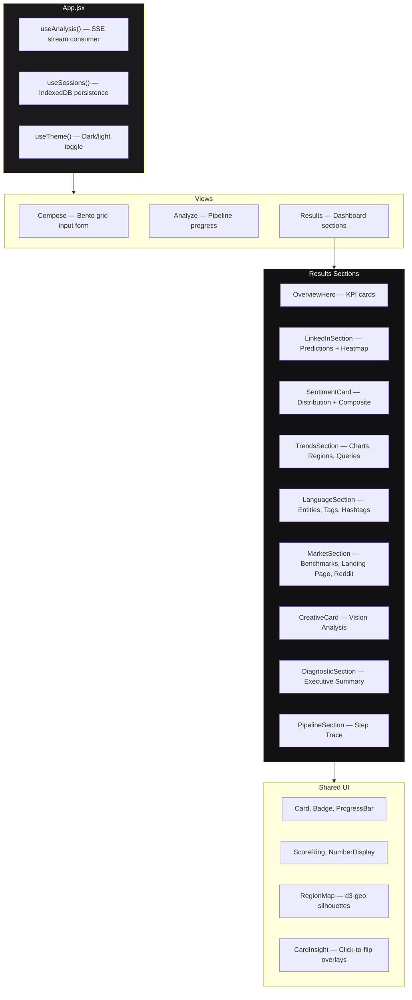

# Polaris

**Ad & Post Performance Analysis Platform**

A full-stack ML pipeline that evaluates ad creatives and social media posts *before* deployment — predicting quality scores, engagement metrics, effective CPC, and providing actionable, research-backed recommendations across 6 platforms.

---

## Architecture Overview



---

## Data Flow (SSE Streaming)



---

## Quality Score Formula



Higher quality = lower cost per click = more clicks per budget. This mirrors the Google Ads auction model where Quality Score inversely affects CPC.

---

## Audience Alignment Pipeline



15 audience tags grounded in the [IAB Audience Taxonomy 1.1](https://github.com/InteractiveAdvertisingBureau/Taxonomies) (1,558 industry-standard segments). Scoring uses `sentence-transformers/all-MiniLM-L6-v2` trained on 1B+ sentence pairs.

| Tag | IAB Segments |
|-----|-------------|
| Gen-Z (18-24) | Age Range 18-24, Technology, Video Gaming, Pop Culture, Style & Fashion |
| Millennials (25-39) | Age Range 25-39, Travel, Food & Drink, Careers, Home & Garden |
| Parents | Household Data, Family & Relationships, Education, Children's Products |
| Professionals | Employment Role, Business & Finance, Careers, Enterprise Solutions |
| Luxury Buyers | Personal Affluence, Style & Fashion, Fine Art, Jewelry & Watches |
| Budget Shoppers | Shopping, Coupons & Discounts, Comparison Shopping |
| Health & Fitness | Healthy Living, Sports & Fitness, Nutrition, Wellness |
| Tech Enthusiasts | Technology & Computing, Consumer Electronics, Software |
| Homeowners | Home Ownership, Home & Garden, Real Estate, DIY |
| Students | College Education, Academic Interests, Education Apps |
| Small Business Owners | Business Services, Marketing Tools, E-commerce |
| Foodies | Food & Drink, Restaurants, Gourmet, Cooking |
| Gamers | Video Gaming, Gaming Accessories, Esports |
| Eco-Conscious | Green Living, Electric Vehicles, Sustainability |
| Sports Fans | Sports, Athletic Wear, Fitness Gear, Live Events |

---

## LinkedIn Post Predictor



### Benchmark Data Sources

| Factor | Source | Finding |
|--------|--------|---------|
| Post length | ConnectSafely 2026 | 1,300-1,900 chars = +47% engagement |
| Format | Social Insider 2025 | Carousel 6.6%, Video 5.6%, Text 1.2% |
| Hashtags | ClosleyHQ (10,000 posts) | 1-3 niche tags = +12.6%, 5+ hurts |
| Storytelling | LinkedIn Algorithm Guide | Beginning-middle-end = +83% |
| CTA | Sprout Social 2025 | Clear call-to-action = +20% |
| Emojis | Buffer 2025 | 1-3 relevant = +25% |
| External links | Hootsuite 2025 | Links reduce reach by ~30% |
| Posting time | Hootsuite/Buffer/Sprout | Tue-Thu 8AM-noon optimal |
| Hook | ConnectSafely 2026 | 60-70% lost at "See more" |
| Industry | ClosleyHQ, Sprout Social | Retail 3.9%, B2B Tech 3.6%, Healthcare 3.3% |

### Quality Score Breakdown

| Factor | Weight | What's Measured |
|--------|--------|----------------|
| Post Length | 15/90 | Optimal range 1,300-1,900 characters |
| Hook Quality | 20/90 | Question, number, colon in first 140 chars |
| Readability | 10/90 | Flesch-Kincaid grade 6-10 optimal |
| Format | 15/90 | Carousel > Video > Image > Text |
| Hashtags | 10/90 | 1-3 niche hashtags optimal |
| CTA | 10/90 | Call-to-action detected in text |
| Sentiment | 5/90 | Slightly positive (0.1-0.5) optimal |
| Formatting | 5/90 | Line breaks, lists, visual structure |

Raw scores normalized to 0-100.

---

## Supported Platforms

| Platform | Ad Placements | Audience Scoring | LinkedIn Mode |
|----------|--------------|-----------------|---------------|
| Meta | Feed, Stories, Reels, Right Column, Marketplace | Yes | — |
| Google | Search, Display, YouTube Pre-roll, Discovery, Shopping | Yes | — |
| TikTok | In-Feed, TopView, Branded Effect, Spark Ads | Yes | — |
| X | Timeline, Explore, Amplify Pre-roll | Yes | — |
| LinkedIn | — (uses Post Type) | Yes | Post prediction, timing heatmap, quality scoring |
| Snapchat | Full Screen, Story, Spotlight, Collection | Yes | — |

---

## ML Models

| Model | Purpose | Size | Source |
|-------|---------|------|--------|
| `spaCy en_core_web_sm` | Named Entity Recognition | 12 MB | spaCy |
| `cardiffnlp/twitter-roberta-base-sentiment` | Sentiment scoring (pos/neg/neu) | 499 MB | HuggingFace |
| `GloVe Twitter 50d` | Hashtag expansion via cosine similarity | 66 MB | Gensim |
| `all-MiniLM-L6-v2` | Audience alignment (sentence embeddings) | 80 MB | HuggingFace |
| `Gemini Vision` | Image/video analysis, OCR, platform fit | API | Google AI |
| `Gemini Flash` | Executive diagnostic synthesis | API | Google AI |
| `HistGradientBoosting` | LinkedIn engagement prediction | ~1 MB | scikit-learn (trained at startup) |
| `textstat` | Readability scoring (Flesch-Kincaid) | <1 MB | PyPI |

---

## Frontend Architecture



### Key Frontend Decisions

- **Tailwind CSS 4** with `@tailwindcss/vite` plugin — class-based dark mode via `@custom-variant`
- **Framer Motion** for all animations — staggered reveals, spring transitions, AnimatePresence
- **d3-geo + topojson** for geographic silhouettes (regions in results, geo picker in compose)
- **Recharts** for time-series charts (90-day trend lines)
- **IndexedDB** stores every input and output — full session replay without server
- **SSE streaming** — results render progressively as each pipeline step completes

---

## Quick Start

### Prerequisites
- Python 3.10+
- Node.js 18+
- ~4GB disk space (ML models downloaded on first run)

### 1. Backend
```bash
cd backend
python3 -m venv venv && source venv/bin/activate
pip install -r requirements.txt
python -m spacy download en_core_web_sm
cp .env.example .env  # Add your Gemini API key (optional)
uvicorn main:app --host 0.0.0.0 --port 8000
```

### 2. Frontend
```bash
cd frontend-react
npm install
npm run dev  # Runs on port 5173, proxies /api to :8000
```

### 3. Open
Navigate to [http://localhost:5173](http://localhost:5173)

### One-Command Alternative
```bash
./run.sh  # Sets up venv, installs deps, downloads models, starts server
```

---

## API Reference

### `POST /api/v1/evaluate_ad_stream`

SSE streaming endpoint. Returns pipeline steps and data events as they complete.

**Content-Type:** `multipart/form-data`

| Field | Type | Default | Description |
|-------|------|---------|-------------|
| `headline` | string | `""` | Ad headline / post hook |
| `body` | string | `""` | Ad body / post content |
| `hashtags` | string | `""` | Comma-separated hashtags |
| `audience` | string | `""` | Audience tag (e.g. "Gen-Z (18-24)") |
| `platform` | string | `"Meta"` | Platform: Meta, Google, TikTok, X, LinkedIn, Snapchat |
| `geo` | string | `"US"` | 2-letter geo code |
| `industry` | string | `""` | Industry vertical for benchmarks |
| `base_cpc` | float | `1.50` | Base cost-per-click |
| `budget` | float | `100.0` | Daily budget |
| `media_file` | file | — | Image or video file |
| `ad_placements` | string | `""` | Comma-separated placements |
| `landing_page_url` | string | `""` | URL for coherence check |
| `competitor_brand` | string | `""` | Brand for Meta Ad Library lookup |
| `post_type` | string | `""` | LinkedIn: text, image, video, document, poll, article |
| `follower_count` | int | `0` | LinkedIn: follower count |

### SSE Event Types

| Event | Data | When |
|-------|------|------|
| `step` | `{step, name, model, duration_ms, status}` | Every pipeline step |
| `vision_data` | `VisionAnalysis` | After visual pipeline |
| `text_data` | `TextAnalysis` | After semantic pipeline |
| `trend_data` | `TrendAnalysis` | After Google Trends |
| `sem_metrics` | `SEMMetrics` | After SEM simulation |
| `landing_page_data` | `LandingPageCoherence` | After URL check |
| `reddit_data` | `RedditSentiment` | After Reddit analysis |
| `benchmark_data` | `IndustryBenchmark` | After benchmark lookup |
| `creative_angles` | `CreativeAlignment` | After trend-copy alignment |
| `audience_data` | `AudienceAnalysis` | After audience scoring |
| `linkedin_data` | `LinkedInPostAnalysis` | After LinkedIn prediction |
| `competitor_data` | `CompetitorIntel` | After Meta Ad Library |
| `diagnostic` | `string` | Executive summary text |
| `done` | — | Pipeline complete |

---

## Project Structure

```
polaris/
├── backend/
│   ├── main.py                  # FastAPI server + full ML pipeline (SSE streaming)
│   ├── models.py                # Pydantic response schemas (15 models)
│   ├── linkedin_scorer.py       # LinkedIn post predictor (features, synthetic data, model)
│   ├── benchmarks.json          # Industry benchmark data
│   ├── requirements.txt         # Python dependencies
│   └── .env.example             # Environment variable template
├── frontend-react/
│   ├── src/
│   │   ├── App.jsx              # Root: view routing, session management
│   │   ├── app.css              # Tailwind 4 theme tokens, base styles
│   │   ├── components/
│   │   │   ├── Compose.jsx      # Bento-grid input form (platform-aware)
│   │   │   ├── Analyze.jsx      # Pipeline progress animation
│   │   │   ├── Results.jsx      # Results dashboard router
│   │   │   ├── TopBar.jsx       # Navigation, session history, theme toggle
│   │   │   ├── Toast.jsx        # Notification toasts
│   │   │   ├── results/
│   │   │   │   ├── OverviewHero.jsx      # KPI cards (QS, eCPC, clicks, entities)
│   │   │   │   ├── LinkedInSection.jsx   # Predictions, quality score, heatmap
│   │   │   │   ├── SentimentCard.jsx     # Distribution + composite score
│   │   │   │   ├── TrendsSection.jsx     # Charts, regions, queries, alignment
│   │   │   │   ├── LanguageSection.jsx   # Entities, tags, hashtags
│   │   │   │   ├── MarketSection.jsx     # Benchmarks, landing page, Reddit, competitors
│   │   │   │   ├── CreativeCard.jsx      # Vision analysis results
│   │   │   │   ├── DiagnosticSection.jsx # Executive summary (markdown)
│   │   │   │   └── PipelineSection.jsx   # Step-by-step trace
│   │   │   └── ui/
│   │   │       ├── Card.jsx, Badge.jsx, ProgressBar.jsx
│   │   │       ├── ScoreRing.jsx, NumberDisplay.jsx
│   │   │       ├── RegionMap.jsx         # d3-geo country/state silhouettes
│   │   │       ├── CardInsight.jsx       # Click-to-flip info overlay
│   │   │       ├── SectionHeader.jsx, EmptyState.jsx
│   │   │       └── TrendIndicator.jsx
│   │   ├── hooks/
│   │   │   ├── useAnalysis.js   # SSE stream consumer + store
│   │   │   ├── useSessions.js   # IndexedDB persistence
│   │   │   └── useTheme.js      # Dark/light mode
│   │   └── lib/
│   │       ├── motion.js        # Framer Motion variants
│   │       ├── regions.js       # Geo code mapping
│   │       └── utils.js         # Shared utilities
│   ├── index.html
│   ├── vite.config.js
│   └── package.json
└── run.sh                       # One-command startup script
```

---

## Design Decisions

1. **Deterministic before Generative** — The LLM (Gemini) only narrates pre-computed metrics. It performs no math, no analysis, no scoring. This eliminates hallucinated numbers.

2. **SSE Streaming** — Results render progressively as each pipeline step completes (~30s total). Users see data arriving in real-time rather than waiting for a blank screen.

3. **IAB-Grounded Audience Scoring** — Audience tags map to the IAB Audience Taxonomy (industry standard used by DSPs/SSPs), not hardcoded opinions. Scoring uses sentence-transformers trained on 1B+ sentence pairs.

4. **Benchmark-Trained LinkedIn Model** — Synthetic training data is generated from published research (Social Insider, Hootsuite, Sprout Social, academic papers), not guesses. The model encodes research findings as learnable patterns.

5. **Full Session Persistence** — Every input field and every pipeline output is stored in IndexedDB. Sessions are replayable without the server.

6. **Platform-Aware Vision Analysis** — The Gemini Vision prompt includes platform-specific best practices (~30 placement-specific context strings) so creative assessment is contextual.

---

## License

MIT
